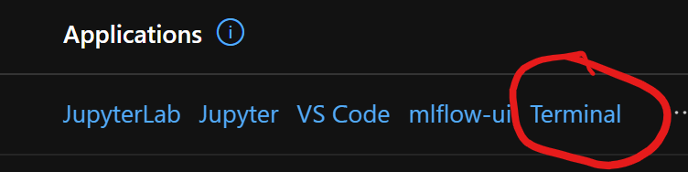
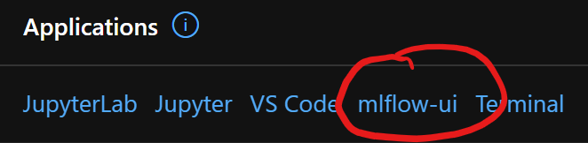

# Streamlit on AzureML

Run Streamlit on AzureML Compute Instances as a custom application

## Instructions

### ARM Template

1. Deploy the above ARM template
   1. Select the existing Workspace name
   1. Select a name for the newly created Compute Instance that will host the UI
1. Navigate to the newly created CI's terminal
   
1. Run `az login` and follow the instructions to log in
1. That's it! Navigate to the mlflow ui app created on the CI in your browser!
   

### Manual

1. Compute Instance in the Workspace of your choice
1. Custom Application in the above CI that references this repo's docker image
   1. Set docker image to `ghcr.io/akshaya-a/azureml-apps-streamlit:main`
   1. Add `/home/azureuser/.azure` : `/home/azureuser/.azure` as a Bind Mount
   1. Set MLFLOW_TRACKING_URI to the AML Workspace's tracking uri (copy from the Azure Portal)
   1. Set HOME to `/home/azureuser`
   1. Expose `5001` on both Target + Published ports
1. Navigate to the newly created CI's terminal
   
1. Run `az login` and follow the instructions to log in
1. That's it! Navigate to the mlflow ui app created on the CI in your browser!
   
